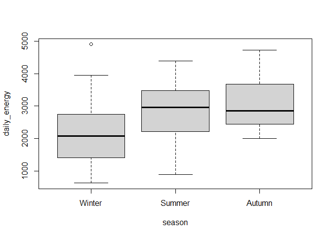
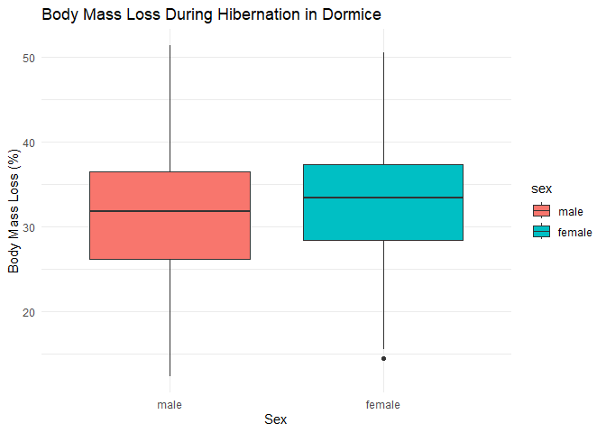

<!-- README.md is generated from README.Rmd. Please edit that file -->

# ecoteach

<!-- badges: start -->

[](https://CRAN.R-project.org/package=ecoteach)
[](https://lifecycle.r-lib.org/articles/stages.html#stable)
[](https://opensource.org/licenses/MIT)
<!-- badges: end -->

The goal of ecoteach is to provide a collection of curated educational
datasets for teaching ecology and agriculture concepts. The package
includes data on wildlife monitoring, plant treatments, and ecological
observations with documentation and examples for educational use.

## Available Datasets

The package includes the following datasets:

    #> - `badger_energy`
    #>  - `barnswallow_brightness`
    #>  - `berberis_treatment`
    #>  - `carrion_arrivals`
    #>  - `chimpanzee_cameras`
    #>  - `dormouse_hibernation`
    #>  - `Dsimulans_matechoice`
    #>  - `elephant_farmers`
    #>  - `lion_reproduction`
    #>  - `magellanic_penguins`
    #>  - `pangolin_habitat`
    #>  - `raccoondog_environment`
    #>  - `scavenger_community`
    #>  - `vulture_diet`
    #>  - `whale_brains`

Each dataset includes comprehensive documentation with details about the
variables, source references, and suggested analyses for teaching
purposes.

## Installation

You can install the released version of ecoteach from
[CRAN](https://CRAN.R-project.org) with:

``` r
install.packages("ecoteach")
```

And the development version from [GitHub](https://github.com/) with:

``` r
# install.packages("devtools")
devtools::install_github("username/ecoteach")
```

## Example

This package provides datasets that can be used to teach ecological and
statistical concepts. Here’s an example using the dormouse hibernation
dataset:

``` r
# Load the package
library(ecoteach)
# Or use devtools::load_all() during development
# devtools::load_all()

# Load the badger energy dataset
data(badger_energy)

# View the data structure
str(badger_energy)
#> Classes 'tbl_df', 'tbl' and 'data.frame':    55 obs. of  8 variables:
#>  $ ID          : Factor w/ 44 levels "12F","13F","14P",..: 1 2 3 4 4 5 6 7 7 8 ...
#>  $ age         : Factor w/ 2 levels "cub","adult": 1 1 2 2 2 2 2 2 1 2 ...
#>  $ sex         : Factor w/ 2 levels "F","M": 1 1 2 2 2 1 2 2 2 2 ...
#>  $ group_size  : num  14 14 5 7 7 14 13 13 14 6 ...
#>  $ body_mass   : num  3.2 3.3 8.9 8.9 8.7 6.4 8.9 9.9 3.7 8.5 ...
#>  $ daily_energy: num  1389 2534 3156 2812 3040 ...
#>  $ season      : Factor w/ 4 levels "Winter","Spring",..: 3 3 1 1 3 3 4 1 3 1 ...
#>  $ disease     : Factor w/ 3 levels "Negative","Diseased",..: 1 1 1 1 1 1 2 1 1 1 ...

# Graph daily energy as a function of season
badger_energy$season <- droplevels(badger_energy$season) 
boxplot(daily_energy~season, data = badger_energy)
```



### Exploring the data

The dormouse hibernation dataset contains data on hibernation patterns
and body mass changes in edible dormice (*Glis glis*). We can create a
simple visualization to explore how body mass changes during
hibernation:

``` r

# Load the data
data(dormouse_hibernation)

# Basic analysis of body mass loss during hibernation

library(ggplot2)

# Calculate percentage of body mass lost
dormouse_hibernation$mass_loss_percent <- 
  (dormouse_hibernation$body_mass_before - dormouse_hibernation$body_mass_after) / 
  dormouse_hibernation$body_mass_before * 100

# Create a boxplot of mass loss percentage by sex
ggplot(dormouse_hibernation, aes(x = sex, y = mass_loss_percent, fill = sex)) +
  geom_boxplot() +
  labs(title = "Body Mass Loss During Hibernation in Dormice",
       x = "Sex",
       y = "Body Mass Loss (%)") +
  theme_minimal()
```



This example shows how the dataset can be used to explore sex
differences in hibernation physiology, which could be used in a teaching
context to demonstrate boxplots, t-tests, or ANOVA.
